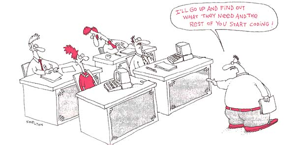

I just started my first job at a software [company](https://www.elementanalytics.com/). We work with industrial IT and OT applications. My first question when I was told about the position was “What languages do I need to know?” I had it still in my mind that software engineering is all about what language(s) you know and how fast you can generate code. Even during my interview, they asked me to code in Python, a language I have still not used in school, I said that I would have to look at Google to figure it out, and they told me of course.  I was convinced that was the end of the interview and the technical viewer was just being nice to me.

``` Python
var arr = []; 

for(var i in obj) arr[+i.substring(1)] = obj[i];

arr = arr.filter(function(i) {  return i || false; });
```

I got the job and I have still not used a single line of code from any of the computer languages that I learned in my college [software engineering class](http://courses.ics.hawaii.edu/ics314f20/). But there are several things I learned in my software engineering class that we used for developing web applications that carried over into the new job. The very first thing I did when I started was how we set up the computer they mailed me.    

## Development Environment

We did a similar thing in my software engineering class early in the semester. We were guided through installing and configuring our [Development Environment](https://www.jetbrains.com/idea/) (the program we would use to write code). In school, it was helpful because by having us all use the same Development Environment the professor could explain things once, and know that we all had the same options appearing on our screens and he had a better idea of what we were looking at. At my new job, this process of setting up my Development Environment was to make sure I had the best settings and programs available to me, to make me better at doing my job. It was an opportunity for me to see more options and different ways I could set up my Development Environment.  

## Coding Standards

We also had some plugins and settings we added to our Development Environment in school, to enforce [Coding Standards](https://github.com/airbnb/javascript). They are guidelines for what your code should look like above and beyond the syntax rules of the language. In class, this helped us find mistakes in our code and speed up the ability for us to understand what we were seeing, as the professor was using the same standards.   

In my new job, these Coding Standards are mostly done by peer review. There are internal documents to describe the standards “important enough” to write down, but I am always learning better ways to code from the suggestions of the senior engineers.   

<div class="ui medium images">
  
</div>

## Project Management

We used a form of Project Management in school to plan and complete large group projects. The type we used is called Agile Project Management, meaning it flexibly changes based upon what you need to get done. The project is split into 7-to-10-day periods, which we called milestones. To keep track of the goals we used another technique called issue-driven project management, which breaks the milestone goals into smaller tasks called issues. All these terms matched very well with an application named [GitHub](https://github.com/), which is used for sharing files, keeping track of changes, and communicating the issues.   

In the new job, we do a very similar process of Sprints, instead of Milestones. Instead of issues, we call them tickets, probably because that matches what our project management application [Jira](https://www.atlassian.com/software/jira) calls them. The process is almost identical to how it worked in the school for web application development.  

<div class="ui medium images">
  
</div>

## Working With Others

Other skills are not exclusive to software engineering that we experienced in my class such as the teamwork where you are independent of supervision, we had to figure out our goals, challenges, and communicate to get our project done. We have supervisors at my job, but they are doing work too and don’t watch over us making us get along.  Documentation is another big thing at my job. My professor had us writing so many essays, some weeks felt it like an English class rather than software engineering. I understand that now, as there is an entire wiki collection full of documents that are similar to these essays, explain the process of how and why things got developed. Written communication is critical for long term projects. Asking questions in a [meaningful way](http://www.catb.org/esr/faqs/smart-questions.html) is also a challenge that our professor issued to us. The first few times someone asked vague or poorly worded questions and he gently nudged them to try again made me cringe. Well, on the job I have seen much harsher responses for vague or poorly worded questions. I see why, you can sometimes find an answer by just being objective about how you ask for help, and you are not asking someone to do all the work, you give them what they may need to be helpful without disrupting their day.   On a lighter note, my training document wants me to develop my “Google-foo”. Learning how to find answers is part of learning in school, and it is a big part of working in a real software engineering setting.    

## Useful in Life???

Of interest to me right now is that I can see ways to use some of the software engineering techniques in life outside of programming. I am planning on moving to Humboldt Co. California after the next semester. My wife and I moved to Hawaii two years ago to attend the University of Hawaii from California. Before that move, we were confident that between the two of us, we could handle the move smoothly. We stopped packing three hours before our flight and left our possessions scattered amongst three of our friends' houses. Arriving in Hawaii missing many things we needed and truly not knowing where some of our stuff is. As a benchmark of how bad the plan worked out, I lost my cane somewhere along the way.  

<div class="ui medium images">
  
</div>

This time we are trying something that we used in my software engineering class, that same Agile Project Management I mentioned earlier. First, we are breaking the whole move into stages, like we would call Milestones in software engineering. We then are looking at the move as a series of goals we want to achieve, in software engineering the goals would be features to implement (or functionality to add).  Rather than looking at each goal as one giant task, we have begun splitting the goals into smaller manageable steps, like the issues in Issue Driven Project management, where the steps are called issues and can be managed using an application like GitHub. We are going to use a different application called [Trello](http://www.trello.com) so that we can keep track of our goals, and smaller steps along the way.  

I'm sure I will see more things that did not seem significant in school, become advantageous to me in the professional world of software engineering. I hope that I use some of the time and confusion saving ideas in my wider life to make things less stressful and not lose things when I move. 


