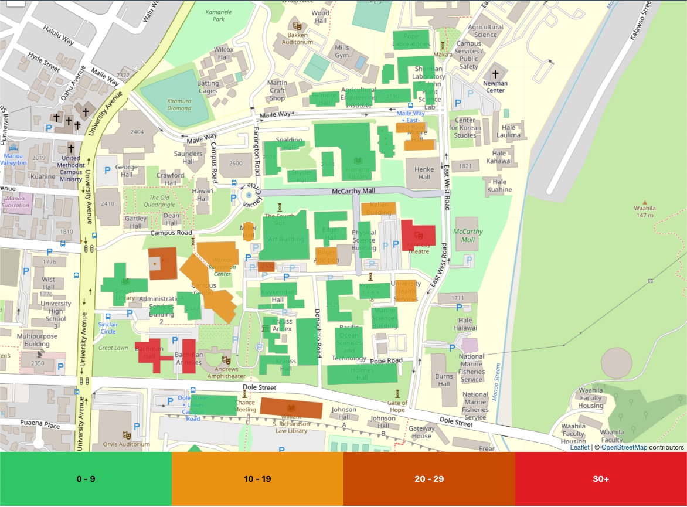

---
layout: essay
type: essay
title: Discovering Design Patterns 
# All dates must be YYYY-MM-DD format!
date: 2020-12-03
labels:
  - Wordpress
  - JavaScript
  - Design Patterns
--- 

The first complete [website](http://gslc.us/) I helped build was hardly complex coding. We used a template and I quickly understood, that all images that I wanted to display were going to be the same size. All the textual information was going to be formatted the same. The head, footer, and navigation were all going to be displayed uniformly throughout the site. I did not have to really look at the PHP code for the site, as the client was being easy and liked the template that he helped select. 

 

As we were finishing the project the client wanted to have specific section headers formatted uniquely from the others (white background to grey, orange font to white, left justified text to center, even the font style was to be changed). I tried to change them individually unsuccessfully, and had to get help from the professor. It was then I realized what the PHP in the WordPress site was doing. I wrote to the template authors and they helped me generate the new type of heading that the client specified and how to implement the new code into the pages. The HTML and CSS were being applied by the PHP to the content based upon what PHP function was assigned to each content element. The content was stored in the database and the PHP was controlling how the displayed page looked. 

 

## Simple-Factory-Pattern 

The template finally made sense, I could assign the content to PHP functions and lay those out to generate each page. This allowed for very uniform appearance in the pages, and was great for allowing us to hand the page to the client when were finished so he could add and update it (if he limited himself to the formatting that was already written in the PHP code). I learned later that this style of designing our application was called a Simple-Factory-Pattern. All content of a type was assigned to a function, and it always displayed in its assigned format. Quite easy for a beginner user, and easy to make changes to as the results of the added content were predictable. 

Recently I have been working in a team to make a map that shows the density of people inside building on our campus. This map could be helpful for the college in dealing with preventing and mitigating crowded conditions during the current coronavirus pandemic. The [web site](https://campus-occupancy.top/#/) associated with this map application is not the challenge, it taking the data set and getting it to display in a meaningful way that matters most. 

To make our map display we used a JavaScript library, [Leaflet](https://leafletjs.com/). It uses a geoJSON file to layer our building labels and locations on top of a Google map. We then use a JSON file with the population at a given time at the labeled buildings in the geoJSON file to color code the map that is displayed. The map that is created by Leaflet is then displayed on the page for the user. 

 

We were tasked with expanding upon our concept, and we decided it would be cool if our intended user, a college employee could upload their own data. They could put in more recent data sets, or even model prediction data to visualize for planning density scenarios. Our second expansion idea was to make our application work for any location, with any data set of density. 

## Model-Control-View-Pattern 

We knew that or map was generated by the data that we input, and the as the data changes the map would be displayed. Our goal is to expand the user’s ability to add data including the location data, so that the displayed map could be changed accordingly. This idea of the functions of the JavaScript controlling the output or view, based upon the data model input is known as the Model Control View design pattern. 

The coolest thing about this design was not realized by us until we looked at how to expand our application. The mapping solution for one specific location and data set could be applied to many locations and data sets by making our code work based upon the functions we wrote controlling the output of the various inputs. 

