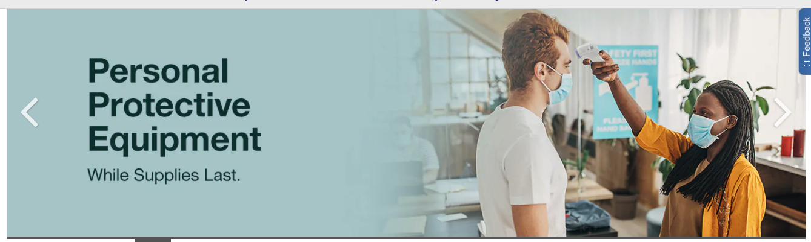

#Different Tools for Different Jobs 

When I took the classes for Web Development at the local junior college, I remember that learning HTML was only the beginning.  I had already taken two consecutive C++ programming classes and I could draw a triangle of asterixis on the screen and had a beginning understanding of conditional statements and object-oriented programming.  But HTML was an instantaneous visualization tool.  It felt like drawing with words on a screen.  If HTML was a pencil, CSS (the next language) added an entire art store’s worth of options for me to use on the screen.  These were all static pages, they did nothing, and nothing changed when the windows were increased or decreased. 

We were told we would eventually get into learning about frameworks, and CSS preprocessors but first we began learning about JavaScript and how to use it on web pages.  So now my projects were enormous.  Almost every HTML element had a class, many had id’s as well.  This all correlated with detailed CSS files, as I got more practice I could us my classes and id’s more strategically, leading to smaller CSS files.  Mixed in all of that was JavaScript script elements, trying to add functionality to my pages.  There had to be an easier way to do all of this. 

##Frameworks make web design easier. 

That’s when we got to use [Bootstrap](https://getbootstrap.com/).  It felt like everything I knew went out the window and I was starting new again.  The Bootstrap elements had all the CSS and functionality baked in.  The names of the elements didn’t always make sense as to their output on the screen.  On top of that, the Bootstrap elements could be adjusted by changing my CSS files. 

After I learned how to navigate the Bootstrap documentation pages, we focused on responsive design.  The mantra was “mobile-first”, and bootstrap had a media-breakpoints that we would implement, as we would design our projects from the smallest of cellphone screen first, all the way up to widescreen monitors.  I learned to view web pages as columns, always thinking about 12 column layouts.   

I loved how easy it was to use a pre-designed theme from the thousands of bootstrap themes available and adjust it to fit my needs.  I never failed to find an answer for any Google search related to bootstrap.  Everything I read described bootstrap as the most used framework and the sheer abundance of information proved those claims.  When we were finally allowed to choose our preferred frameworks not one of my classmates switched away from bootstrap. 

In my software development class, we are speeding through languages and uses, after HTML and CCSS, we used the [Semantic UI] (https://semantic-ui.com/) framework.  I struggled at first with the simplicity of its elements.  We aren't doing web design perse, but rather simple web pages.  After thinking mobile-first and focusing on the responsive design I had to refocus on the assigned tasks in this class and de-program my breakpoint, 12 columns thinking.  I read through the Semantic UI documentation and found how responsiveness in incorporated in the elements themselves.   

I liked that the Semantic elements were easy to implement in the class of the div.  It easy to tell them apart from other classes as “ui” is part of the class name.  The documentation feels a little easier to navigate that Bootstrap, perhaps because there are fewer elements and less adjustability.  One of our assignments was to use Semantic UI to copy an existing web page.  It was supposed to be a perfect copy, nor have all the functionality, but I was up for a challenge. 

##Features or Ease of Use 

The page I picked, [Costco](https://www.costco.com/), has a carousel near the top.  Carousels are one of my favorite design elements.  They were tricky at first to learn, then bootstrap made them infinitely easier, but they are worth the effort. I couldn’t find a carousel in the Semantic UI documentation.  My google search revealed that I needed to integrate additional libraries to get a working carousel (this was outside of the scope of the assignment). 

 

As we continued with the work, there were a few times when a google search did not yield direct answers for my Semantic UI questions.  There are fewer users, therefore less online discussions, and it seems that the type of sites that use it are a little simpler in design.   

I don’t think that I can say one framework is “better” than the other.  I know that if I wanted me to make a responsive site very quickly and could accept design limits, I would use Semantic UI.  I find that it is really fast to use, with little additional CSS to make the product meet most designs.  If I wanted to have the ability to add any features, and the design I idea was very specific, I would use bootstrap.  Not only does it appear to do more, but there is also much more help available online and from my peers. 
