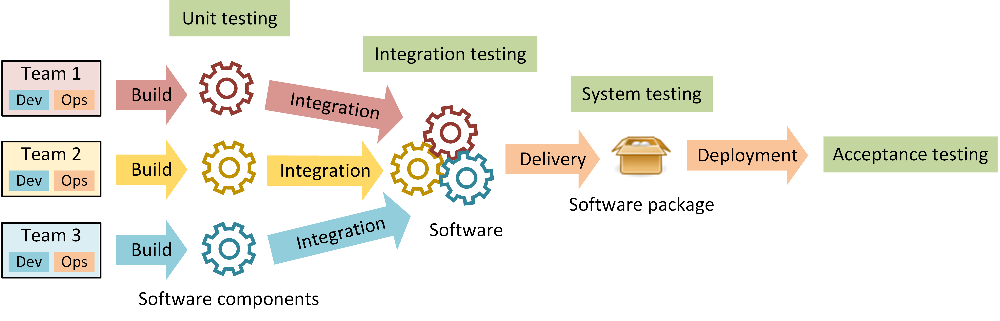

As a student, I am at that point where I can start making decisions about my educational path.  This is exciting because almost everything is interesting to me, but I must make some decisions.  I started by asking all my friends that have graduated for advice.  I asked them what they do, how much they enjoy it, and how they got there.  We discussed the workplaces and salaries of the different types of jobs in their experience. 

Most of my friends recommend different books, websites, podcasts, or topics for me to explore.  I read [The Pheonix Project](https://www.oreilly.com/library/view/the-phoenix-project/9781457191350/), I listened to [Darknet Diaries](https://darknetdiaries.com/). I experimented with setting up a [LAMP server on a raspberry Pi](https://projects.raspberrypi.org/en/projects/lamp-web-server-with-wordpress), [Docker](https://docker-curriculum.com/), [Klubernetes](https://kubernetes.io/docs/tutorials/), [Azure](https://azure.microsoft.com/en-us/free/students/), [IBM Developer](https://developer.ibm.com/) and [AWS](https://aws.amazon.com/education/awseducate/). I completed coding challenges online and started learning Python through an online [tutorial](https://www.w3schools.com/python/). 

The path that interests me most is Continuous Integration and Continuous Development (CI/CD).  It interests me as its role keeps evolving and expanding. It places you at the center of the action, where hardware and the development teams in a company act.  Sometimes called DevOps, or Network Engineer, communication is the primary trait that companies seek, followed by what seems to be a little knowledge of everything and a strong desire to learn. 

  

My friends with these positions are constantly learning new languages, applications, and hardware specifications.  They are excited to be on the front line of their companies, having to stay informed about the latest projects and technology.  They usually work remotely (even before COVID) and often on-call.  Aside from making sure all the newest changes are deployed successfully, they are also responsible for resolving problems that haven't occurred yet by writing solutions that prevent or respond to as many potential scenarios as they can imagine. 

    

My work history is primarily in leading teams and working with multiple organizations at a time.  I have also almost always had an emergency response element throughout my work history with many on-call duties.  I enjoy ever-changing workplaces and being on the leading edge of new ideas.  This semester I am taking a Software Development class, as well as Databases Design and the prerequisite class for Security classes.  I plan on taking more security and networking classes in the future as I move closer to my goal.
