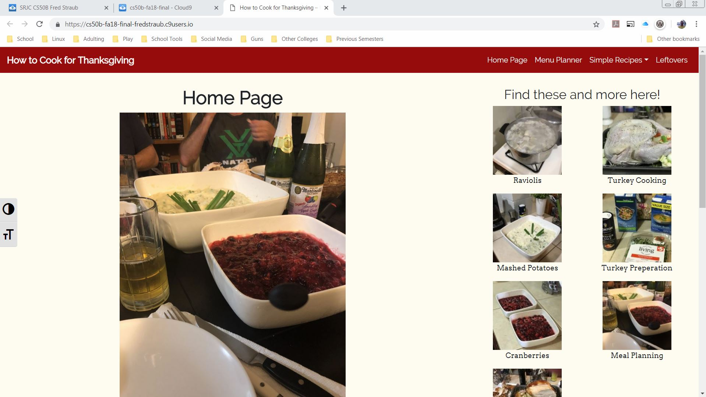
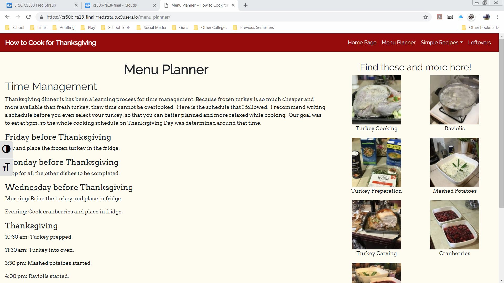
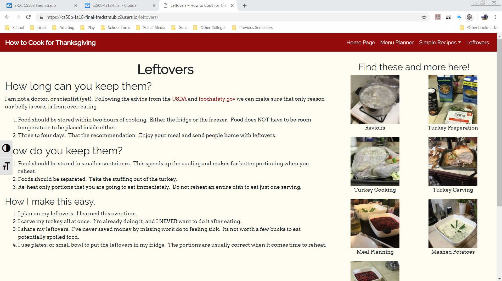
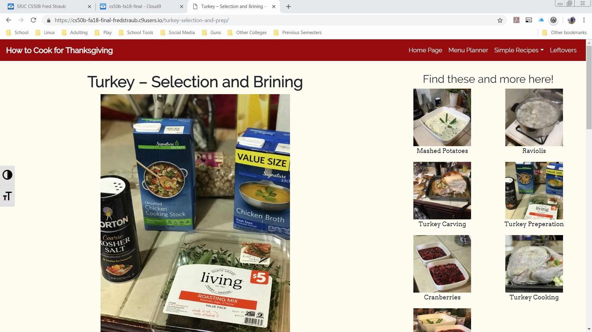
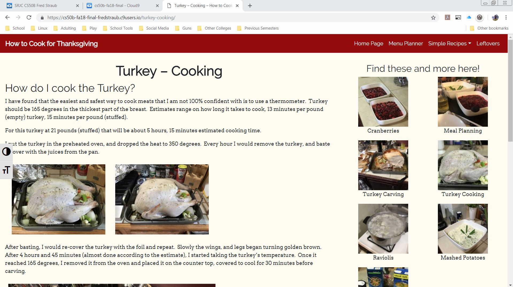
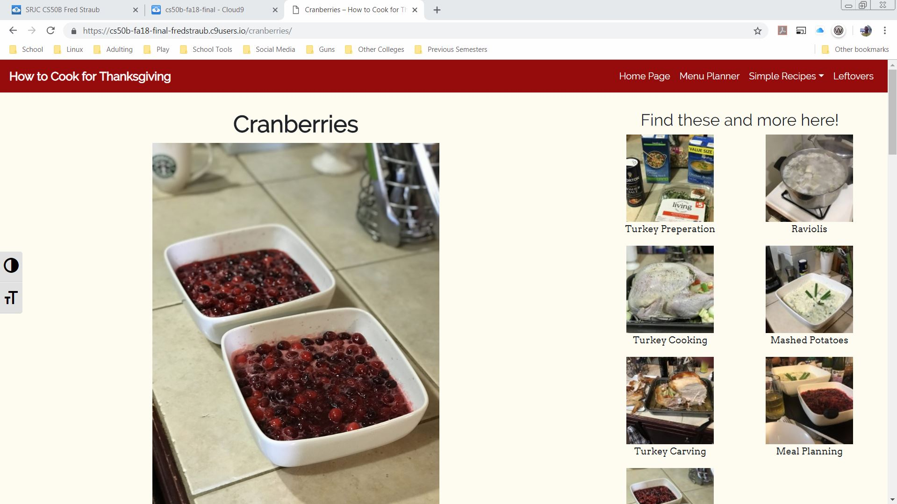
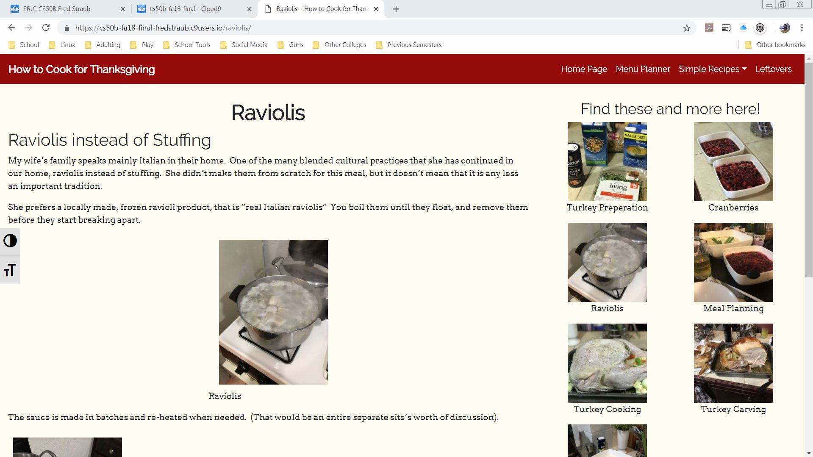
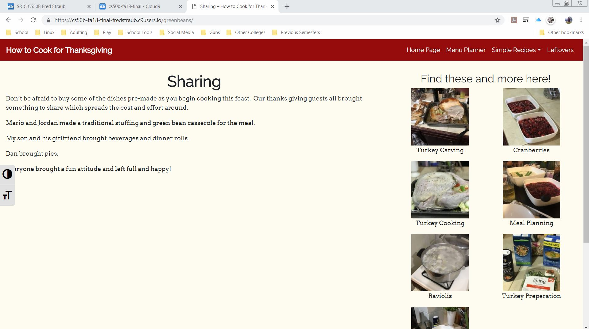
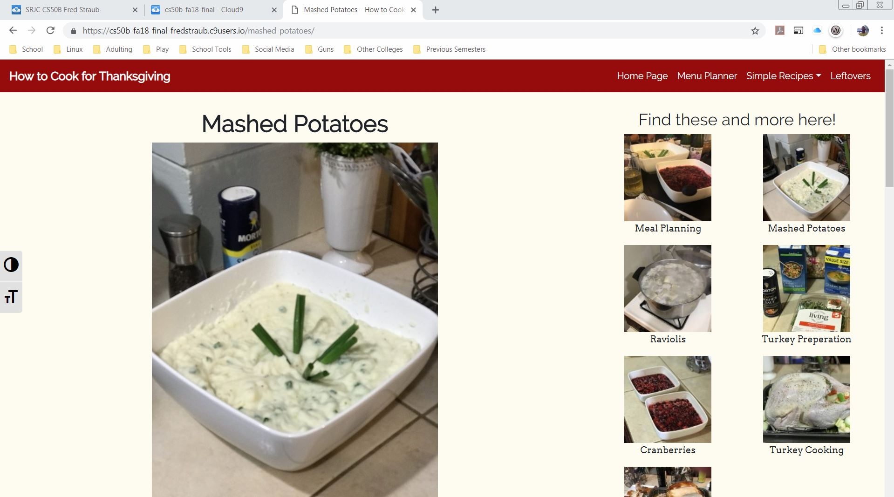
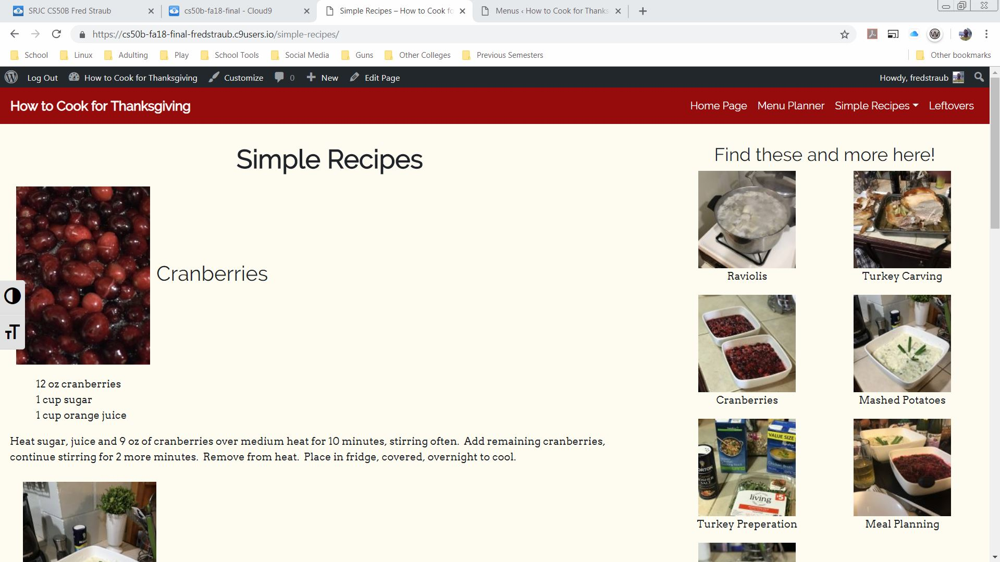

This responsive site was the final project for the Web Design Certificate I earned at the Santa Rosa Junior College.  I used HTML, CSS, and MySQLi on a Wordpress CMS. I had to create and edit all of my own content using AdobeCreativeCloud applications.  In this project I had to combine all of the skills and tools I had leanred to use for a full-stack project.

Unfortunately the project was hosted on Cloud9, before that site ended its education support.  I have these photos of screen shots fromthe site while it was active. 

