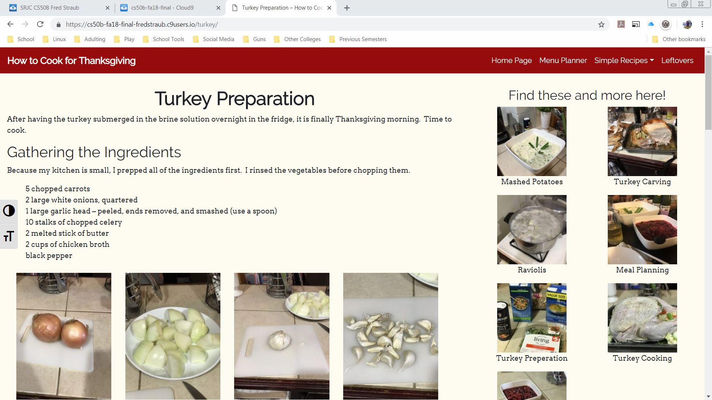

This responsive site was the final project for the Web Design Certificate I earned at the Santa Rosa Junior College. I made a website that shows exactly how I cooked my Thanksgiving dinner, including recipes.  So many of my friends complained they didn’t know how to cook Thanksgiving dinner. 

I used HTML, CSS, and MySQLi on a WordPress CMS. I had to create and edit all my own content using Adobe Creative Cloud applications.    

In this project I had to combine all the skills and tools I had learned to use for a full-stack project. Unfortunately, the project was hosted on Cloud9, before that site ended its education support.  I have these photos of screen shots from the site while it was active. 

  
  
  
  

