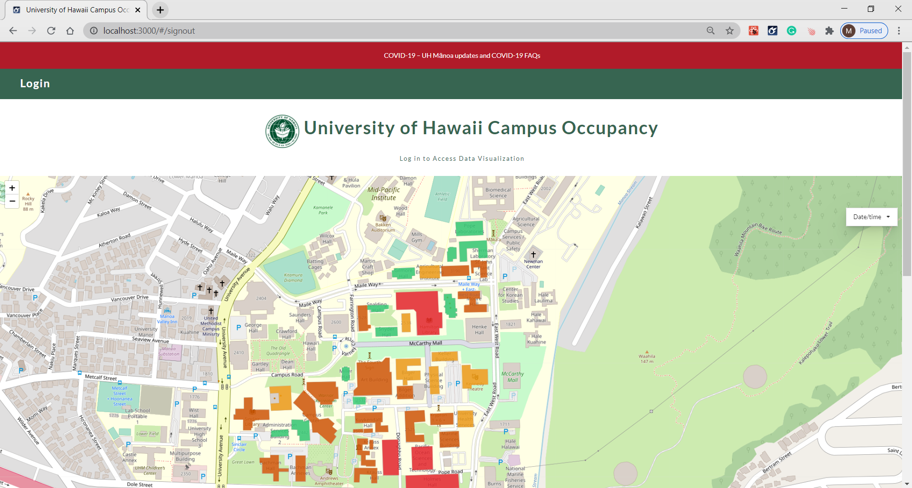
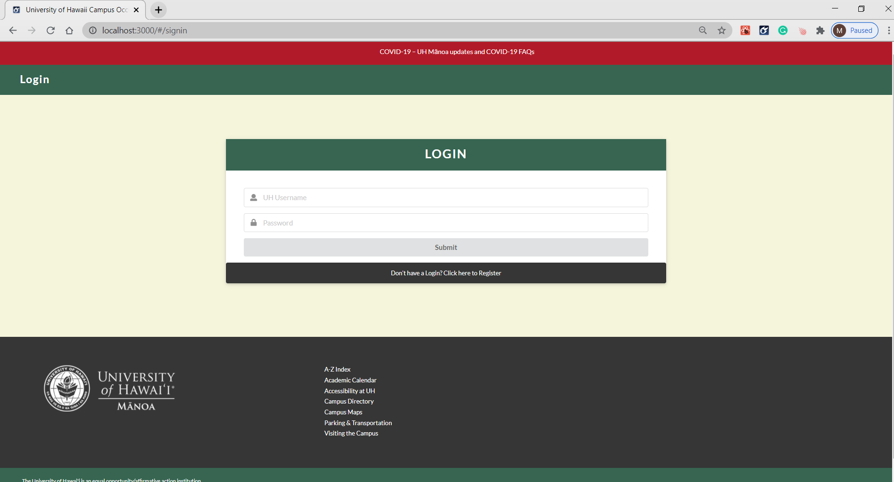
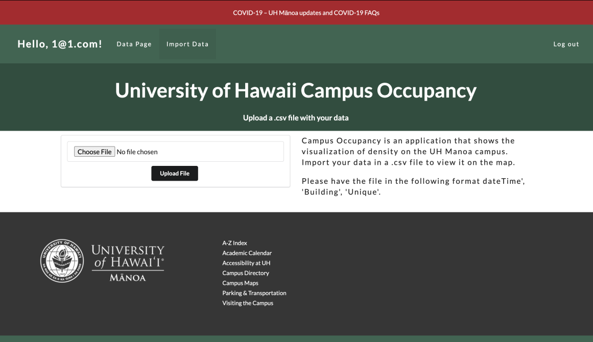

[Marcos Buccat](https://buccatm.github.io/), [Caliana Fortin](https://calianafortin.github.io/) and I had earlier in the semester begun the process of joining the [HAAC2020](https://hacc.hawaii.gov/) competition planning on doing the UH-Occupancy project.  We all decided we didnt have time to compete in the contest.  A few weeks later the final project in our class started. We were a team again and we set out to complete the same project from the HAAC2020 contest as our final project.

### Landing page

  

The application we built is a data visulization tool, that color-codes the buildings on the University of Hawaii at Manoa based upon their occupancy.  The tool is intended for the campus administration to see how people are grouped during the day to make improvements due to the coronoavirus social distancing guidelines.  It uses data given to us by the university that shows how many devices are connected to wi-fi access points in three hour increments.

The project was scheduled to take several week's with three milestones.  We used the Agile software development model along with Issue Driven Project Management as tools to help us finish and to experience some industry practices along the way.  By the time we started this project we had become familiar with GitHub and were going to use that for tracking our issues.  We used IntelliJ as our developement environment, and learned to implement GitHub CI into our code pushes. We set up automatic test configurations, and learned how to obtain a URL and deployed the site to a web service.  We made the site using a template that we had used in class already.

### User Login page

  

During this project there were a few issues that each of us worked on, for me the biggest learning experiences resulted from:
1) Writing the tests for the automatic testing that was implemented in the GitHub CI.
2) Learning how to delploy the site to the web, including the tools to check the status of the collections and data when it was delpoyed.
3) Figuring out how to turn 19,000 line JSON files into useful 600 line files.

As a group we had to learn to communicate more as we progressed.  It was challenging to have worked the whole semester remotely, never seeing my classmates adn then transitioning to team work.  As a group we collaborated alot on the final javaScript code to get to site to function.  Getting the templete and the Javascript library [Leaflet](https://leafletjs.com/reference-1.7.1.html)(our mappping resource) to work together was final speedbump at the end.

### Data upload page

  

## Project links
You can visit the site here [Campus-Occupancy](https://campus-occupancy.top/#/).
The GitHub Project page is here [Campus-Occupany](https://campus-occupancy.github.io/)
The GitHub code repo is here [campus-occupancy](https://github.com/campus-occupancy/campus-occupancy)

