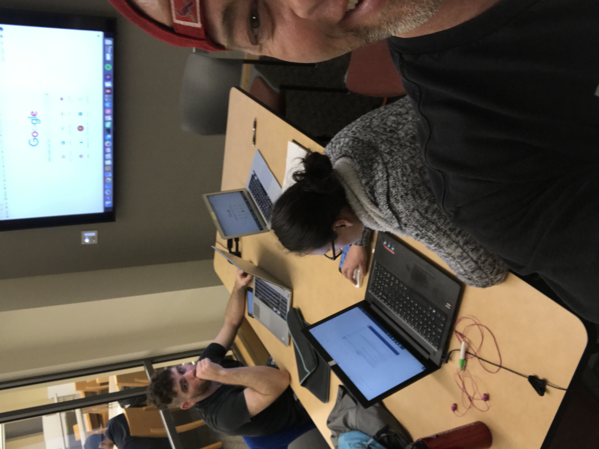
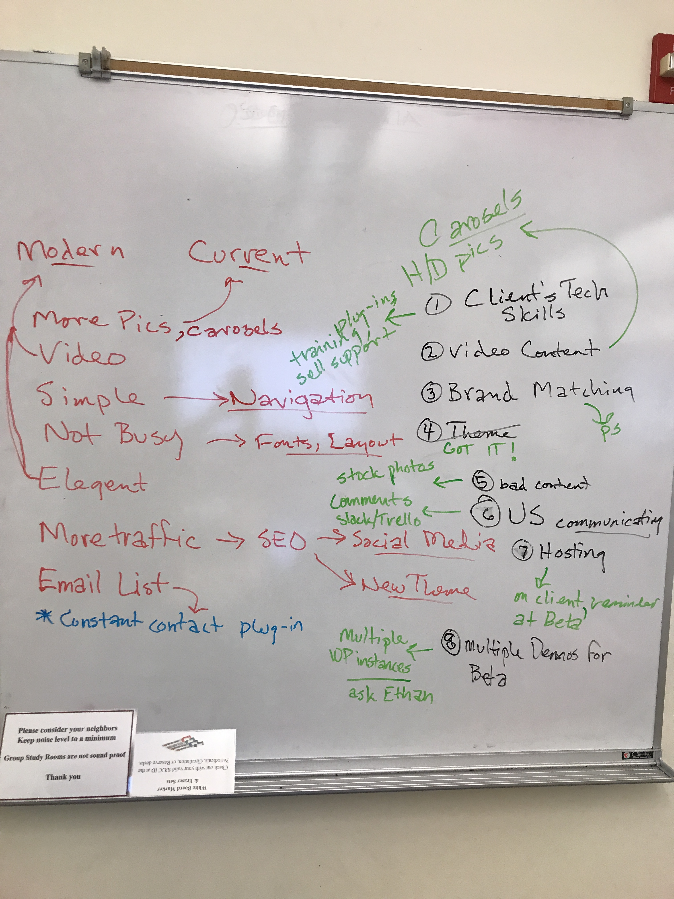

  
  

The final class at the Santa Rosa Junior College for the Web Development Certificate is service-based.  The class is also the capstone class for Sound Media and Film certificates.  The college works with local nonprofits offering help with websites, radio, and film production.  In the class, we treat the projects as if we were small businesses and the nonprofits are clients.  The professors are only there to guide and help with collaboration between the different types of students, as we were encouraged to utilize the skill of all the different students to make the project better.

For this project, we used the SCRUM method with short sprint cycles.  I ended up in the role of Scrum Master, and developer.  Our nonprofit was the Golden State Land Conservancy.  They had a self-built site from the early 1990s that was very bad looking and had may functional problems.  We completely discarded the site and through many meetings and iterations got to a product that the client loved.

The client ultimately wanted a theme that was developed by a third-party, which was purchased and deployed using WordPress.  We found a cost-saving hosting company for the client and migrated to the finished site.  Using the third-party theme was a great lesson in the importance of clear and concise documentation.

Occasionally this nonprofit reaches out to me for help updating and answering questions about thier site.

You can visit the site here [Golden State Land Conservancy](http://gslc.us).

